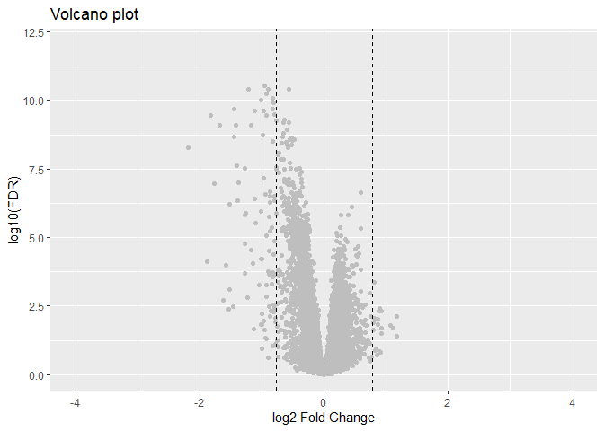
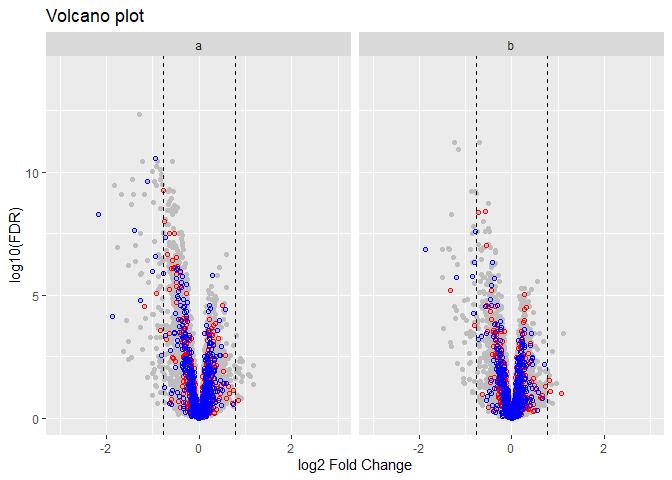
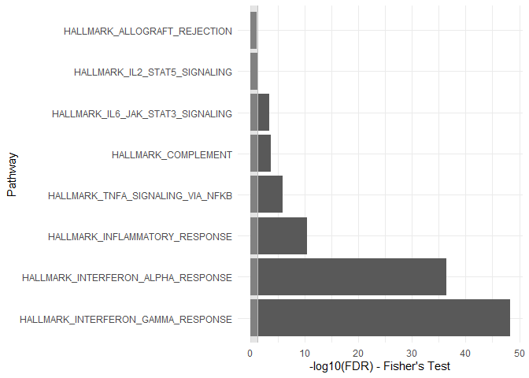
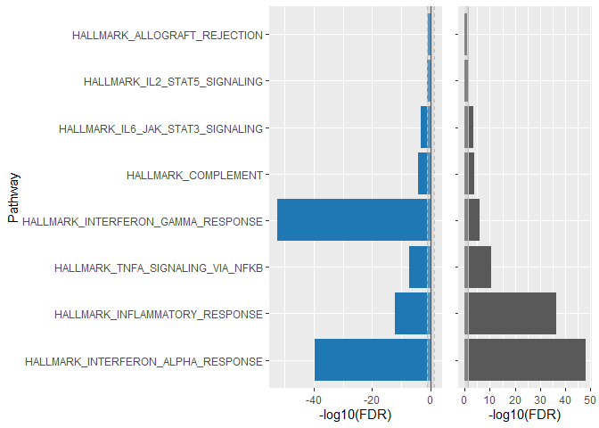

RNAseq Visualization Automation
================

RNAseq Visualization Automation
===============================

 

Install RVA 
``` r
install.packages("RVA")
```

 

Load package for use

``` r
library(RVA)
```

 

Load Example Data
=================

Let's load a summary statistics tables and combine them into a list named **d1**.  

``` r
df <- RVA::Sample_summary_statistics_table
df1 <- RVA::Sample_summary_statistics_table1 
d1 <- list(df, df1)
```

 

This is head of the first summary statictic table present in the list:  

|                    |       logFC|   AveExpr|          t|  P.Value|  adj.P.Val|         B|
|:-------------------|-----------:|---------:|----------:|--------:|----------:|---------:|
| ENSG00000123610.5  |  -1.2886593|  4.306067|  -8.647905|        0|          0|  28.14522|
| ENSG00000148926.10 |  -0.9519794|  6.083623|  -8.015885|        0|          0|  23.54129|
| ENSG00000141664.9  |  -0.8942611|  5.356978|  -7.922250|        0|          0|  22.86899|
| ENSG00000104320.13 |  -0.5723190|  4.574599|  -7.853658|        0|          0|  22.36399|
| ENSG00000120217.14 |  -1.2170891|  3.112864|  -7.874408|        0|          0|  22.31510|
| ENSG00000152778.9  |  -0.9307776|  4.302267|  -7.771144|        0|          0|  21.76999|

 

The row names are gene id, the supported gene id can be one of: ACCNUM, ALIAS, ENSEMBL, ENSEMBLPROT, ENSEMBLTRANS, ENTREZID, ENZYME, EVIDENCE, EVIDENCEALL, GENENAME, GO, GOALL, IPI, MAP, OMIM. For the provided sample datasets in this package we only have ENSEMBL id's for gene id type.  

Functions
=========

Cutoff Plot
-----------

 

This function checks the number of differencialy expressed (DE) genes at different cutoff combinations. It process summary statistics table generated by differential expression analysis like limma or DESeq2, as input data, to evaluate the number of differntially expressed genes with different FDR and fold change cutoff.  

Below are the default parameters for plot\_cutoff. You can change them to modify your output. Use `help(plot_cutoff)` to learn more about the parameters.  

``` r
plot_cutoff(data = data,
  comp.names = NULL,
  FCflag = "logFC",
  FDRflag = "adj.P.Val",
  FCmin = 1.2,
  FCmax = 2,
  FCstep = 0.1,
  p.min = 0,
  p.max = 0.2,
  p.step = 0.01,
  plot.save.to = NULL,
  gen.3d.plot = TRUE,
  gen.plot = TRUE)
```

 

### 1.1 Cutoff Plot - Input: a data frame.

``` r
cutoff.result <- plot_cutoff(data = df,
                       gen.plot = TRUE,
                       gen.3d.plot = TRUE)
```

 

The result object **cutoff.result** takes a data frame as an input data and contains 3 objects:  

**1.** A table that summarizes the number of DE genes under threshold combination  

``` r
head(cutoff.result[[1]])
```

| pvalue | FC  |  Number\_of\_Genes|
|:-------|:----|------------------:|
| 0      | 1.2 |                  0|
| 0.01   | 1.2 |               1135|
| 0.02   | 1.2 |               1246|
| 0.03   | 1.2 |               1302|
| 0.04   | 1.2 |               1345|
| 0.05   | 1.2 |               1388|

 

**2.** A 3D plotly object, where the x-axis is Fold change threshold, y-axis is FDR cutoff, and z-axis is the number of DE genes under the x,y combination:  

``` r
cutoff.result[[2]]
```

 

**3.** A plot to visualize it:

``` r
cutoff.result[[3]]
```

  

**Saving figures**  

Figures can be saved using two approaches:  

**1.** Using imbedded fucntion with predetermined dpi  

``` r
plot_cutoff(data = df,
            plot.save.to = "cut_off_selection_plot.png")
```

 

**2.** Using ggsave from the ggplot2 library with option to customize the width, height and dpi.  

``` r
library(ggplot2)
ggsave("cut_off_selection_plot.png", cutoff.result[[3]], width = 5, height = 5, dpi = 300)
```

 

 

### 1.2 Cutoff Plot - Input: a list.

 

``` r
cutoff.result.list <- plot_cutoff(data = d1, 
                                  comp.names = c('a', 'b'))
```

 

The result object **cutoff.result.list** takes a list as an input data and contains 2 objects:  

**1.** A table that summarizes the number of DE genes under threshold combination for each of the data frames in the list.  

``` r
head(cutoff.result.list[[1]])
```

| Comparisons.ID | pvalue | FC  |  Number\_of\_Genes|
|:---------------|:-------|:----|------------------:|
| a              | 0.01   | 1.2 |               1135|
| a              | 0.05   | 1.2 |               1388|
| a              | 0.1    | 1.2 |               1526|
| a              | 0.2    | 1.2 |               1712|
| a              | 0.01   | 1.3 |                514|
| a              | 0.05   | 1.3 |                606|

 

**2.** A plot to visualize it. A 3D plotly object is not created for a list input data.  

``` r
cutoff.result.list
```

  

**Saving figures**  

Figures can be saved using two approaches:  

**1.** Using imbedded fucntion with predetermined dpi  

``` r
plot_cutoff(data = d1,
            comp.names = c("A", "B"),
            plot.save.to = "cut_off_list_plot.png")
```

 

**2.** Using ggsave from the ggplot2 library with option to customize the width, height and dpi.  

``` r
library(ggplot2)
ggsave("cut_off_list_plot.png", cutoff.result.list, width = 5, height = 5, dpi = 300)
```

 

 

 

QQ Plot
-------

 

This is the function to generate a qqplot object with confidence interval from the input data. The input data is a summary statistics table or a list that contains multiple summary statistics tables from limma or DEseq2, where each row is a gene.  

### 2.1 QQ Plot - Input: a data frame.

 

``` r
qq.result <- plot_qq(df)
qq.result
```

  

**Saving figures**  

Figures can be saved using two approaches:  

**1.** Using imbedded fucntion with predetermined dpi  

``` r
plot_qq(data = df,
        plot.save.to = "qq_plot.png")
```

 

**2.** Using ggsave from the ggplot2 library with option to customize the width, height and dpi.  

``` r
library(ggplot2)
ggsave("qq_plot.png", qq.result, width = 5, height = 5, dpi = 300)
```

 

### 2.2 QQ Plot - Input: a list.

 

**plot\_qq** function can also take a list as an input data, but requires *comp.names* to be specified. The result object is a set of qq plots for each of the data frames in the list.  

``` r
qq.list.result <- plot_qq(data = d1, 
        comp.names = c('A', 'B'))
qq.list.result
```

  

**Saving figures**  

Figures can be saved using two approaches:  

**1.** Using imbedded fucntion with predetermined dpi  

``` r
plot_qq(data = d1,
        comp.names = c("A", "B"),
        plot.save.to = "qq_list_plot.png")
```

 

**2.** Using ggsave from the ggplot2 library with option to customize the width, height and dpi.  

``` r
library(ggplot2)
ggsave("qq_list_plot.png", qq.list.result, width = 5, height = 5, dpi = 300)
```

 

 

 

Volcano Plot
------------

 

This is the function to process the summary statistics table generated by differential expression analysis like limma or DESeq2 and generate the volcano plot with the option of highlighting the individual genes or gene set of interest (like disease-related genes from Disease vs Healthy comparison). The input data is a summary statistics table or a list that contains multiple summary statistics tables from limma or DEseq2, where each row is a gene.  

Below are the default parameters for plot\_volcano. You can change them to modify your output. Use `help(plot_volcano)` to learn more about the parameters.  

``` r
plot_volcano(
  data = data,
  comp.names = NULL,
  geneset = NULL,
  geneset.FCflag = "logFC",
  highlight.1 = NULL,
  highlight.2 = NULL,
  upcolor = "#FF0000",
  downcolor = "#0000FF",
  plot.save.to = NULL,
  xlim = c(-4, 4),
  ylim = c(0, 12),
  FCflag = "logFC",
  FDRflag = "adj.P.Val",
  highlight.FC.cutoff = 1.5,
  highlight.FDR.cutoff = 0.05,
  title = "Volcano plot",
  xlab = "log2 Fold Change",
  ylab = "log10(FDR)"
)
```

 

### 3.1 Volcano Plot - Input: a data frame.

 

``` r
plot_volcano(data = df)
```

  

### 3.2 Volcano Plot - Input: a list.

 

Volcano Plot can also take a list as an input data with specified **comp.name** for each data frame.  

``` r
plot_volcano(data = d1, 
             comp.names = c('a', 'b'))
```

  

### 3.3 Highlight genes of interest in the volcano plot

 

You can highlight gene sets (like disease related genes from a Disease vs Healthy comparison).  

The gene set to be highlighted in the volcano plot can be spesified in two ways:  

**1.** A summary statistics table with the highlighted genes as row names (the gene name format needs to be consistent with the main summary statistics table). For example, this summary statistics table could be the statistical analysis output from a Disease vs Healthy comparison (only containing the subsetted significant genes).  

**2.** One or two vectors consisting of gene names. The gene name format needs to be consistent with the main summary statistics table. It can be set by the parameters highlight.1 and highlight.2. For example, you can assign the up-regulated gene list from the Disease vs Healthy comparison to highlight.1 and down-regulated gene list from the comparison to highlight.2.  

**Example using option 1** (use summary statistics table's row name to highlight genes):  

``` r
#disease gene set used to color volcanoplot
dgs <- RVA::Sample_disease_gene_set 
```

 

``` r
head(dgs)
```

<table style="width:100%;">
<colgroup>
<col width="22%" />
<col width="13%" />
<col width="12%" />
<col width="13%" />
<col width="12%" />
<col width="12%" />
<col width="13%" />
</colgroup>
<thead>
<tr class="header">
<th align="left"></th>
<th align="right">logFC</th>
<th align="right">AveExpr</th>
<th align="right">t</th>
<th align="right">P.Value</th>
<th align="right">adj.P.Val</th>
<th align="right">B</th>
</tr>
</thead>
<tbody>
<tr class="odd">
<td align="left">ENSG00000176749.9</td>
<td align="right">0.1061454</td>
<td align="right">6.034635</td>
<td align="right">-1.1704309</td>
<td align="right">0.2446236</td>
<td align="right">0.9188735</td>
<td align="right">-5.6468338</td>
</tr>
<tr class="even">
<td align="left">ENSG00000086619.13</td>
<td align="right">0.0862010</td>
<td align="right">2.100165</td>
<td align="right">-0.3331558</td>
<td align="right">0.7397177</td>
<td align="right">0.9989991</td>
<td align="right">-5.7218518</td>
</tr>
<tr class="odd">
<td align="left">ENSG00000198324.13</td>
<td align="right">-0.1321791</td>
<td align="right">5.702730</td>
<td align="right">1.2768794</td>
<td align="right">0.2046170</td>
<td align="right">0.8889442</td>
<td align="right">-5.5265238</td>
</tr>
<tr class="even">
<td align="left">ENSG00000134531.10</td>
<td align="right">-0.4778738</td>
<td align="right">4.562272</td>
<td align="right">3.6721593</td>
<td align="right">0.0003892</td>
<td align="right">0.0298096</td>
<td align="right">-0.1135281</td>
</tr>
<tr class="odd">
<td align="left">ENSG00000116260.17</td>
<td align="right">0.1842322</td>
<td align="right">2.905702</td>
<td align="right">1.6108394</td>
<td align="right">0.1103830</td>
<td align="right">0.7809130</td>
<td align="right">-4.7560495</td>
</tr>
<tr class="even">
<td align="left">ENSG00000104518.11</td>
<td align="right">0.1452149</td>
<td align="right">-3.776628</td>
<td align="right">0.2584838</td>
<td align="right">0.7965675</td>
<td align="right">0.9989991</td>
<td align="right">-4.9101962</td>
</tr>
</tbody>
</table>

 

You can also specify the range of the plot by *xlim* and *ylim*.  

``` r
plot_volcano(data = df,
             geneset = dgs,
             upcolor = "#FF0000",
             downcolor = "#0000FF",
             xlim = c(-3,3),
             ylim = c(0,14))
```

  

By default, the genes which have positive fold change in the provided **geneset** parameter will be colored yellow, and negative fold will be colored purple, this also can be changed by specifying *upcolor* and *downcolor*:  

``` r
plot_volcano(data = d1,
             comp.names = c('a', 'b'),
             geneset = dgs,
             upcolor = "#FF0000",
             downcolor = "#0000FF",
             xlim = c(-3,3),
             ylim = c(0,14))
```

  

**Example with option 2** You can also specify the color of **highlight.1** with *upcolor* parameter and **highlight.2** with *downcolor* parameter.  

``` r
volcano.result <- plot_volcano(data = df,
                  highlight.1 = c("ENSG00000169031.19","ENSG00000197385.5","ENSG00000111291.8"),
                  highlight.2 = c("ENSG00000123610.5","ENSG00000120217.14", "ENSG00000138646.9", "ENSG00000119922.10","ENSG00000185745.10"),
                  upcolor = "darkred",
                  downcolor = "darkblue",
                  xlim = c(-3,3),
                  ylim = c(0,14))
volcano.result
```

  

**Saving figures**  

Figures can be saved using two approaches:  

**1.** Using imbedded fucntion with predetermined dpi  

``` r
plot_volcano(data = df,
             geneset = dgs,
             plot.save.to = "volcano_plot.png")
```

 

**2.** Using ggsave from the ggplot2 library with option to customize the width, height and dpi.  

``` r
library(ggplot2)
ggsave("volcano_plot.png", volcano.result, width = 5, height = 5, dpi = 300)
```

 

 

 

Pathway analysis plot
---------------------

 

This is the function to do pathway enrichment analysis (and visualization) with rWikiPathways (also KEGG, REACTOME & Hallmark) from a summary statistics table generated by differential expression analysis like limma or DESeq2. In directional enrichment analysis, the sign(positive/negative) indicates the direction of the enrichement, not the mathematical sign of -log10(FDR), for example, the positive sign indicate the up-regulated genes in geneset is over-represented in all the genes in the genome are up-regulated.

Below are the default parameters for plot\_pathway. You can change them to modify your output. Use `help(plot_pathway)` to learn more about the parameters.  

``` r
plot_pathway(
  data = df,
  comp.names = NULL,
  gene.id.type = "ENSEMBL",
  FC.cutoff = 1.3,
  FDR.cutoff = 0.05,
  FCflag = "logFC",
  FDRflag = "adj.P.Val",
  Fisher.cutoff = 0.1,
  Fisher.up.cutoff = 0.1,
  Fisher.down.cutoff = 0.1,
  plot.save.to = NULL,
  pathway.db = "rWikiPathways"
  )
```

 

Our sample dataset provided in the package only contains ENSEMBL gene id types. Other types can be used by changing the parameter `gene.id.type = " id type"`. When inputing a single data frame for analysis, `comp.names` are not required. Currently we are using rWikiPathways as a database for enrichment analysis but this can be changed to KEGG, REACTOME, Hallmark or a static version of rWikiPathways by changing the parameter `pathway.db = "database name"`.  

``` r
pathway.result <- plot_pathway(data = df, pathway.db = "Hallmark", gene.id.type = "ENSEMBL")
```

 

### 4.1 Pathway analysis result is a list that contains 5 objects:

 

**1.** Pathway analysis table with directional result (test up-regulated gene set and down-regulated gene set respectively).  

``` r
head(pathway.result[[1]])
```

<table>
<colgroup>
<col width="28%" />
<col width="28%" />
<col width="17%" />
<col width="8%" />
<col width="9%" />
<col width="7%" />
</colgroup>
<thead>
<tr class="header">
<th align="left">ID</th>
<th align="left">Description</th>
<th align="right">directional.p.adjust</th>
<th align="left">direction</th>
<th align="right">log10.padj</th>
<th align="left">fil.cor</th>
</tr>
</thead>
<tbody>
<tr class="odd">
<td align="left">HALLMARK_INTERFERON_ALPHA_RESPONSE</td>
<td align="left">HALLMARK_INTERFERON_ALPHA_RESPONSE</td>
<td align="right">0.0000000</td>
<td align="left">down</td>
<td align="right">-39.600163</td>
<td align="left">#1F78B4</td>
</tr>
<tr class="even">
<td align="left">HALLMARK_INFLAMMATORY_RESPONSE</td>
<td align="left">HALLMARK_INFLAMMATORY_RESPONSE</td>
<td align="right">0.0000000</td>
<td align="left">down</td>
<td align="right">-12.298898</td>
<td align="left">#1F78B4</td>
</tr>
<tr class="odd">
<td align="left">HALLMARK_TNFA_SIGNALING_VIA_NFKB</td>
<td align="left">HALLMARK_TNFA_SIGNALING_VIA_NFKB</td>
<td align="right">0.0000000</td>
<td align="left">down</td>
<td align="right">-7.302635</td>
<td align="left">#1F78B4</td>
</tr>
<tr class="even">
<td align="left">HALLMARK_INTERFERON_GAMMA_RESPONSE</td>
<td align="left">HALLMARK_INTERFERON_GAMMA_RESPONSE</td>
<td align="right">0.0000000</td>
<td align="left">down</td>
<td align="right">-52.486092</td>
<td align="left">#1F78B4</td>
</tr>
<tr class="odd">
<td align="left">HALLMARK_COMPLEMENT</td>
<td align="left">HALLMARK_COMPLEMENT</td>
<td align="right">-0.0000473</td>
<td align="left">down</td>
<td align="right">-4.325453</td>
<td align="left">#1F78B4</td>
</tr>
<tr class="even">
<td align="left">HALLMARK_IL6_JAK_STAT3_SIGNALING</td>
<td align="left">HALLMARK_IL6_JAK_STAT3_SIGNALING</td>
<td align="right">-0.0003144</td>
<td align="left">down</td>
<td align="right">-3.502524</td>
<td align="left">#1F78B4</td>
</tr>
</tbody>
</table>

 

**2.** Pathway analysis table with non-directional fisher's enrichment test result for all DE genes regardless of direction.  

``` r
head(pathway.result[[2]])
```

<table style="width:100%;">
<colgroup>
<col width="38%" />
<col width="38%" />
<col width="10%" />
<col width="11%" />
</colgroup>
<thead>
<tr class="header">
<th align="left">ID</th>
<th align="left">Description</th>
<th align="right">pvalue</th>
<th align="right">p.adjust</th>
</tr>
</thead>
<tbody>
<tr class="odd">
<td align="left">HALLMARK_INTERFERON_GAMMA_RESPONSE</td>
<td align="left">HALLMARK_INTERFERON_GAMMA_RESPONSE</td>
<td align="right">0.00e+00</td>
<td align="right">0.0000000</td>
</tr>
<tr class="even">
<td align="left">HALLMARK_INTERFERON_ALPHA_RESPONSE</td>
<td align="left">HALLMARK_INTERFERON_ALPHA_RESPONSE</td>
<td align="right">0.00e+00</td>
<td align="right">0.0000000</td>
</tr>
<tr class="odd">
<td align="left">HALLMARK_INFLAMMATORY_RESPONSE</td>
<td align="left">HALLMARK_INFLAMMATORY_RESPONSE</td>
<td align="right">0.00e+00</td>
<td align="right">0.0000000</td>
</tr>
<tr class="even">
<td align="left">HALLMARK_TNFA_SIGNALING_VIA_NFKB</td>
<td align="left">HALLMARK_TNFA_SIGNALING_VIA_NFKB</td>
<td align="right">1.00e-07</td>
<td align="right">0.0000013</td>
</tr>
<tr class="odd">
<td align="left">HALLMARK_COMPLEMENT</td>
<td align="left">HALLMARK_COMPLEMENT</td>
<td align="right">1.92e-05</td>
<td align="right">0.0001763</td>
</tr>
<tr class="even">
<td align="left">HALLMARK_IL6_JAK_STAT3_SIGNALING</td>
<td align="left">HALLMARK_IL6_JAK_STAT3_SIGNALING</td>
<td align="right">4.26e-05</td>
<td align="right">0.0003269</td>
</tr>
</tbody>
</table>

 

**3.** Pathway analysis plot with directional result.  

``` r
pathway.result[[3]]
```

  

**4.** Pathway analysis plot with non-directional result.  

``` r
pathway.result[[4]]
```

  

**5.** Pathway analysis plot with combined direaction and non-directional result.  

``` r
pathway.result[[5]]
```

  

**Saving figures**  

Figures can be saved using ggsave from the ggplot2 library.  

``` r
library(ggplot2)
ggsave("joint_plot.png",pathway.result[[5]], width = 5, height = 5, dpi = 300)
```

 

### 4.2 Pathway analysis for the list of summary tables will result in a list that contains 4 objects:

 

Pathways with list of data as input, the list can be replaced with `d1` from the top. When list inputs are given `comp.names` should be speicified in order to identify the comparison groups.  

``` r
list.pathway.result <- plot_pathway(data = list(df,df1),comp.names=c("A","B"),pathway.db = "Hallmark", gene.id.type = "ENSEMBL")
```

 

**1.** Pathway analysis table with directional result for all datasets submited.  

``` r
head(list.pathway.result[[1]])
```

<table style="width:100%;">
<colgroup>
<col width="11%" />
<col width="25%" />
<col width="25%" />
<col width="15%" />
<col width="7%" />
<col width="8%" />
<col width="6%" />
</colgroup>
<thead>
<tr class="header">
<th align="left">Comparisons.ID</th>
<th align="left">ID</th>
<th align="left">Description</th>
<th align="right">directional.p.adjust</th>
<th align="left">direction</th>
<th align="right">log10.padj</th>
<th align="left">fil.cor</th>
</tr>
</thead>
<tbody>
<tr class="odd">
<td align="left">A</td>
<td align="left">HALLMARK_INTERFERON_ALPHA_RESPONSE</td>
<td align="left">HALLMARK_INTERFERON_ALPHA_RESPONSE</td>
<td align="right">0.0000000</td>
<td align="left">down</td>
<td align="right">-39.600163</td>
<td align="left">#1F78B4</td>
</tr>
<tr class="even">
<td align="left">A</td>
<td align="left">HALLMARK_INFLAMMATORY_RESPONSE</td>
<td align="left">HALLMARK_INFLAMMATORY_RESPONSE</td>
<td align="right">0.0000000</td>
<td align="left">down</td>
<td align="right">-12.298898</td>
<td align="left">#1F78B4</td>
</tr>
<tr class="odd">
<td align="left">A</td>
<td align="left">HALLMARK_TNFA_SIGNALING_VIA_NFKB</td>
<td align="left">HALLMARK_TNFA_SIGNALING_VIA_NFKB</td>
<td align="right">0.0000000</td>
<td align="left">down</td>
<td align="right">-7.302635</td>
<td align="left">#1F78B4</td>
</tr>
<tr class="even">
<td align="left">A</td>
<td align="left">HALLMARK_INTERFERON_GAMMA_RESPONSE</td>
<td align="left">HALLMARK_INTERFERON_GAMMA_RESPONSE</td>
<td align="right">0.0000000</td>
<td align="left">down</td>
<td align="right">-52.486092</td>
<td align="left">#1F78B4</td>
</tr>
<tr class="odd">
<td align="left">A</td>
<td align="left">HALLMARK_COMPLEMENT</td>
<td align="left">HALLMARK_COMPLEMENT</td>
<td align="right">-0.0000473</td>
<td align="left">down</td>
<td align="right">-4.325453</td>
<td align="left">#1F78B4</td>
</tr>
<tr class="even">
<td align="left">A</td>
<td align="left">HALLMARK_IL6_JAK_STAT3_SIGNALING</td>
<td align="left">HALLMARK_IL6_JAK_STAT3_SIGNALING</td>
<td align="right">-0.0003144</td>
<td align="left">down</td>
<td align="right">-3.502524</td>
<td align="left">#1F78B4</td>
</tr>
</tbody>
</table>

 

**2.** Pathway analysis table with non directional result for all datasets submited.  

``` r
head(list.pathway.result[[2]])
```

<table>
<colgroup>
<col width="14%" />
<col width="33%" />
<col width="33%" />
<col width="9%" />
<col width="10%" />
</colgroup>
<thead>
<tr class="header">
<th align="left">Comparisons.ID</th>
<th align="left">ID</th>
<th align="left">Description</th>
<th align="right">pvalue</th>
<th align="right">p.adjust</th>
</tr>
</thead>
<tbody>
<tr class="odd">
<td align="left">A</td>
<td align="left">HALLMARK_INTERFERON_GAMMA_RESPONSE</td>
<td align="left">HALLMARK_INTERFERON_GAMMA_RESPONSE</td>
<td align="right">0.00e+00</td>
<td align="right">0.0000000</td>
</tr>
<tr class="even">
<td align="left">A</td>
<td align="left">HALLMARK_INTERFERON_ALPHA_RESPONSE</td>
<td align="left">HALLMARK_INTERFERON_ALPHA_RESPONSE</td>
<td align="right">0.00e+00</td>
<td align="right">0.0000000</td>
</tr>
<tr class="odd">
<td align="left">A</td>
<td align="left">HALLMARK_INFLAMMATORY_RESPONSE</td>
<td align="left">HALLMARK_INFLAMMATORY_RESPONSE</td>
<td align="right">0.00e+00</td>
<td align="right">0.0000000</td>
</tr>
<tr class="even">
<td align="left">A</td>
<td align="left">HALLMARK_TNFA_SIGNALING_VIA_NFKB</td>
<td align="left">HALLMARK_TNFA_SIGNALING_VIA_NFKB</td>
<td align="right">1.00e-07</td>
<td align="right">0.0000013</td>
</tr>
<tr class="odd">
<td align="left">A</td>
<td align="left">HALLMARK_COMPLEMENT</td>
<td align="left">HALLMARK_COMPLEMENT</td>
<td align="right">1.92e-05</td>
<td align="right">0.0001763</td>
</tr>
<tr class="even">
<td align="left">A</td>
<td align="left">HALLMARK_IL6_JAK_STAT3_SIGNALING</td>
<td align="left">HALLMARK_IL6_JAK_STAT3_SIGNALING</td>
<td align="right">4.26e-05</td>
<td align="right">0.0003269</td>
</tr>
</tbody>
</table>

 

**3.** Pathway analysis plot with directional result for list of summary tables.  

``` r
list.pathway.result[[3]]
```

  

**4.** Pathway analysis plot with non directional result for list of summary tables.  

``` r
list.pathway.result[[4]]
```

  

**Saving figures**  

Figures can be saved using ggsave from the ggplot2 library.  

``` r
library(ggplot2)
ggsave("non-directional.png",pathway.result[[4]], width = 5, height = 5, dpi = 300)
```

 

 

 

Heatmap
-------

 

### 5.1 Heatmap

 

You can plot a heatmap from raw data rather than a summary statistics table. `plot_heatmap.expr` has the ability to calculate average expression values and change from baseline. Importantly, these calculations do not calculate statistical signifance or correct for confounding factors - they should not be used as statistical analyses but as data overviews.  

For this, you need a count table and annotation table. The count table should have the geneid as row names and the samples as column names. These column names must match the `sample.id` column in your annotation file:  

``` r
count <- RVA::count_table[,1:50]
```

 

``` r
count[1:6,1:5]
```

|                    |   A1|  A10|  A11|  A12|  A13|
|:-------------------|----:|----:|----:|----:|----:|
| ENSG00000121410.11 |    2|    5|    4|    2|    2|
| ENSG00000166535.19 |    0|    0|    0|    0|    0|
| ENSG00000094914.12 |  405|  493|  422|  346|  260|
| ENSG00000188984.11 |    0|    0|    0|    0|    0|
| ENSG00000204518.2  |    0|    0|    0|    0|    0|
| ENSG00000090861.15 |  555|  782|  674|  435|  268|

 

``` r
annot <- RVA::sample_annotation[1:50,]
```

 

``` r
head(annot)
```

| sample\_id | tissue |  subject\_id|  day| Treatment    | subtissue |
|:-----------|:-------|------------:|----:|:-------------|:----------|
| A1         | Blood  |         1091|    0| Treatment\_1 | Blood     |
| A10        | Blood  |         1095|   14| Placebo      | Blood     |
| A11        | Blood  |         1095|   28| Placebo      | Blood     |
| A12        | Blood  |         1097|    0| Placebo      | Blood     |
| A13        | Blood  |         1097|   14| Placebo      | Blood     |
| A14        | Blood  |         1097|   28| Placebo      | Blood     |

 

Plot a simple summary of expression values:  

Use `help(plot_heatmap.expr)` for more information on the parameters.  

``` r
hm.expr <- plot_heatmap.expr(data = count, 
                             annot = annot,
                             sample.id = "sample_id",
                             annot.flags = c("day", "Treatment"),
                             ct.table.id.type = "ENSEMBL",
                             gene.id.type = "SYMBOL",
                             gene.names = NULL,
                             gene.count = 10,
                             title = "RVA Heatmap",
                             fill = "CPM",
                             baseline.flag = "day",
                             baseline.val = "0",
                             plot.save.to = NULL,
                             input.type = "count")
```

 

The result of **plot\_heatmap.expr** with **fill = CPM** contains 2 objects:  

**1.** Heat map  

  

**2.** A data frame of CPM values (fill = CPM in this example) for each geneid split by treatment group and time point.  

``` r
head(hm.expr[[2]])
```

<table>
<colgroup>
<col width="17%" />
<col width="11%" />
<col width="15%" />
<col width="12%" />
<col width="16%" />
<col width="12%" />
<col width="16%" />
</colgroup>
<thead>
<tr class="header">
<th align="left">geneid</th>
<th align="right">0_Placebo</th>
<th align="right">0_Treatment_1</th>
<th align="right">14_Placebo</th>
<th align="right">14_Treatment_1</th>
<th align="right">28_Placebo</th>
<th align="right">28_Treatment_1</th>
</tr>
</thead>
<tbody>
<tr class="odd">
<td align="left">ENSG00000019582</td>
<td align="right">12.88519</td>
<td align="right">12.95117</td>
<td align="right">13.35188</td>
<td align="right">13.10461</td>
<td align="right">13.44575</td>
<td align="right">12.92982</td>
</tr>
<tr class="even">
<td align="left">ENSG00000089157</td>
<td align="right">13.53517</td>
<td align="right">13.56759</td>
<td align="right">13.09506</td>
<td align="right">13.60246</td>
<td align="right">13.16606</td>
<td align="right">12.99473</td>
</tr>
<tr class="odd">
<td align="left">ENSG00000142534</td>
<td align="right">12.74876</td>
<td align="right">12.79580</td>
<td align="right">12.62589</td>
<td align="right">12.97305</td>
<td align="right">12.60354</td>
<td align="right">12.21103</td>
</tr>
<tr class="even">
<td align="left">ENSG00000148303</td>
<td align="right">12.96778</td>
<td align="right">12.98249</td>
<td align="right">12.68783</td>
<td align="right">13.03604</td>
<td align="right">12.77388</td>
<td align="right">12.45019</td>
</tr>
<tr class="odd">
<td align="left">ENSG00000156508</td>
<td align="right">15.57407</td>
<td align="right">15.63724</td>
<td align="right">15.13047</td>
<td align="right">15.42868</td>
<td align="right">15.31821</td>
<td align="right">15.33419</td>
</tr>
<tr class="even">
<td align="left">ENSG00000166710</td>
<td align="right">13.69652</td>
<td align="right">13.68064</td>
<td align="right">14.08861</td>
<td align="right">13.28912</td>
<td align="right">14.16103</td>
<td align="right">13.59287</td>
</tr>
</tbody>
</table>

 

**Customize the plot & Save the figure**  

Here is an example of how you can customize your output dimensions and save your new output using the png() function. Always make sure that the ComplexHeatmap library is loaded for the draw function.  

``` r
library(ComplexHeatmap)
png("heatmap_plots2cp.png", width = 500, height = 500)
draw(hm.expr$gp)
dev.off()
```

 

To calculate CFB from your input data, you must specify the baseline. The heatmap shown below compares each treatment on days 14 and 28 to the respective treatment on day 0.  

Use `help(plot_heatmap.expr)` for more information on the parameters.  

``` r
hm.expr.cfb <- plot_heatmap.expr(data = count, 
                                 annot = annot,
                                 sample.id = "sample_id",
                                 annot.flags = c("day", "Treatment"),
                                 ct.table.id.type = "ENSEMBL",
                                 gene.id.type = "SYMBOL",
                                 gene.names = NULL,
                                 gene.count = 10,
                                 title = "RVA Heatmap",
                                 fill = "CFB",
                                 baseline.flag = "day",
                                 baseline.val = "0",
                                 plot.save.to = NULL,
                                 input.type = "count")
```

 

The result of **plot\_heatmap.expr** with **fill = CFB** contains 2 objects:

**1.** Heat map  

  

**2.** A data frame of change from baselines values (fill = CFB in this example) for each geneid split by treatment group and time point.  

``` r
head(hm.expr.cfb[[2]])
```

| geneid          |  14\_Placebo|  14\_Treatment\_1|  28\_Placebo|  28\_Treatment\_1|
|:----------------|------------:|-----------------:|------------:|-----------------:|
| ENSG00000069482 |    -3.120986|         1.4161927|   -0.9142305|         2.3416320|
| ENSG00000108107 |     2.930098|        -0.3906393|    2.9803268|        -0.7834090|
| ENSG00000128422 |    -2.060845|         0.5122622|   -2.6034678|         0.0996217|
| ENSG00000149925 |     2.735214|        -0.3762279|    2.6791153|        -0.7753080|
| ENSG00000160862 |    -2.688269|         0.5648108|   -2.5291108|         0.3503731|
| ENSG00000165953 |    -3.160729|         0.2600754|   -2.5078464|         0.0210713|

 

**Customize the plot & Save the figure**  

Here is an example of how you can customize your output dimensions.  

``` r
library(ComplexHeatmap)
png("heatmap_plots1cf.png", width = 500, height = 500)
draw(hm.expr.cfb$gp)
dev.off()
```

 

 

 

Gene expression
---------------

 

### 6.1 Gene expression

 

Let's load in the sample data provided in this package. Note that the count table containing data must have the geneid set as the rownames and must have column names which match the `sample.id` column of the annotation file.  

``` r
anno <- RVA::sample_annotation
```

 

``` r
head(anno)
```

| sample\_id | tissue |  subject\_id|  day| Treatment    | subtissue |
|:-----------|:-------|------------:|----:|:-------------|:----------|
| A1         | Blood  |         1091|    0| Treatment\_1 | Blood     |
| A10        | Blood  |         1095|   14| Placebo      | Blood     |
| A11        | Blood  |         1095|   28| Placebo      | Blood     |
| A12        | Blood  |         1097|    0| Placebo      | Blood     |
| A13        | Blood  |         1097|   14| Placebo      | Blood     |
| A14        | Blood  |         1097|   28| Placebo      | Blood     |

 

``` r
ct <- RVA::sample_count_cpm
```

 

``` r
ct[1:6,1:5]
```

|                    |      A1|     A10|     A11|     A12|     A13|
|:-------------------|-------:|-------:|-------:|-------:|-------:|
| ENSG00000166535.19 |  8.5629|  7.6227|  7.7743|  7.6845|  8.5539|
| ENSG00000094914.12 |  3.1405|  8.2261|  7.9616|  8.1047|  7.8747|
| ENSG00000188984.11 |  5.7477|  7.7889|  8.0268|  7.8954|  8.0294|
| ENSG00000090861.15 |  8.2753|  8.1688|  8.6159|  7.3708|  7.7271|
| NA                 |      NA|      NA|      NA|      NA|      NA|
| NA.1               |      NA|      NA|      NA|      NA|      NA|

 

Below is a simple plot using the defaults. Further parameter changes can allow you to change the log scaling, the input type to either cpm or count, and the genes selected for plotting. The sample table we are using already has data points as CPM, so we will use CPM as our `input.type`.  

Use `help(plot_gene)` for more information on the parameters.  

``` r
gene.result <- plot_gene(ct, 
               anno,
               gene.names = c("AAAS", "A2ML1", "AADACL3", "AARS"),
               ct.table.id.type = "ENSEMBL",
               gene.id.type = "SYMBOL",
               treatment = "Treatment",
               sample.id = "sample_id",
               time = "day",
               log.option = TRUE,
               plot.save.to = NULL,
               input.type = "cpm")
```

 

The result of **plot\_gene** contains 2 objects:  

**1.** A gene expression plot that distinguishes log cpm gene expression for each geneid across the treatment groups and time points.  

  

**2.** A table that shows gene expression values by gene id, treatment group and time point with both sample ids and gene symbols.  

``` r
head(gene.result[[2]])
```

| geneid          | sample\_id |   exprs| Treatment    | day | SYMBOL |
|:----------------|:-----------|-------:|:-------------|:----|:-------|
| ENSG00000166535 | A1         |  8.5629| Treatment\_1 | 0   | A2ML1  |
| ENSG00000166535 | A10        |  7.6227| Placebo      | 14  | A2ML1  |
| ENSG00000166535 | A11        |  7.7743| Placebo      | 28  | A2ML1  |
| ENSG00000166535 | A12        |  7.6845| Placebo      | 0   | A2ML1  |
| ENSG00000166535 | A13        |  8.5539| Placebo      | 14  | A2ML1  |
| ENSG00000166535 | A14        |  7.9185| Placebo      | 28  | A2ML1  |

 

**Customize the plot & Save the figure**  

Here is an example of how you can customize your output dimensions and save your new plot using the ggsave function. Always make sure that the ggplot2 library is loaded.  

``` r
library(ggplot2)
ggsave(gene.result, "gene_plots1_4.png", device = "png", width = 100, height = 100, dpi = 200, limitsize = FALSE)
```
