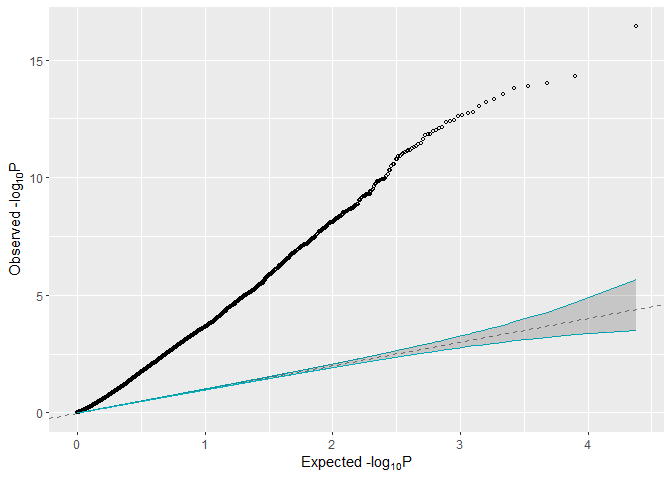

---
output:
  pdf_document: default
  html_document: default
---
---
title: 'RVA: An R package for RNASeq result visualization and pathway enrichment analysis'
tags:
  - R
  - RNAseq
  - Pathway analysis

authors:
  - name: Xingpeng Li
    orcid: 0000-0002-1331-1225
    affiliation: 1
  - name: Siddhartha Pachhai 
    affiliation: 1
  - name: Tatiana Gelaf Romer 
    affiliation: 1
  - name: Elizabeth Kieras
    affiliation: 1
  - name: Craig Hyde
    affiliation: 1
affiliations:
 - name: Pfizer Inc.
   index: 1
date: 4 January 2021

# Summary
RNAseq has been used extensively to evaluate gene expression in various of tissue and blood samples. Driven by the decreasing cost of sequencing and other advantages, it has emerged as an attractive alternative to traditional microarray for transcriptional profiling.

A routine RNAseq analysis pipeline consists of quality control and mapping to reference genome to obtain a matrix containing gene counts value, whereas it comes with n rows of genes and p columns of samples. Researchers often analyze RNA-seq studies to identify differentially expressed genes (DEGs) between control and treatment groups using popular RNA-seq analysis packages like ``Limma``[@Ritchie2015] or ``DESeq2``[@Love2014], ended up with a summary statistic table contain p value and log fold change of each gene from the differential expression analysis. Multiple methods and visualization approaches have been used to evaluate the summary statistic table and there is an increasing need to automate these visualizations and produce a consistent and comprehensive evaluation from summary statistic tables.

In the R package `RVA`, we automated the downstream analysis process from summary statistic table to visualize  RNAseq analysis result. With this package, the user can instantly identify the number of differentially expressed genes (DEGs) by various of pre-specified cutoffs with fold change and FDR as shown in Fig.1, whereas the x-axis shows the fold change cutoff and each of the 4 bars shows the number of DEGs passed in combination of fold change cutoff and the FDR cutoff. We also provided a convenient qqplot function to visualize the overall effect from a single summary statistics table or a multi-facet qqplot to compare multiple summary statistics tables as shown in Fig. 2.

Volcano plot has been routinely used to visualize both the log fold change and FDR to check DEGs. We have included volcano plot function and also with the functionality to highlight the interested genes as shown in Fig. 3.

We also provide a convenient function to process pathway enrichment analysis through ``clusterProfiler``[@Yu2012]. It utilizes the Fisher's exact test to evaluate gene set or pathway enrichment in a convenient and efficient manner. We use a log transformed FDR value to visualize the significantly enriched pathways through a barplot for single summary statistics table or a multi-facet barplot for multiple summary statistics tables result comparison as shown in Fig. 4.

In addition, we have included the functions to conveniently generate heatmap and plot prespecified genes on a boxplot as shown in Fig. 5 and Fig. 6. 

The package can be installed via CRAN https://cran.r-project.org/web/packages/RVA/index.html and is also available on github https://github.com/THERMOSTATS/RVA.

# Acknowledgements

We acknowledge contributions from Olya Besedina, Aliyah Olaniyan, and Zhan Ye during the development and testing of this project.

# References
